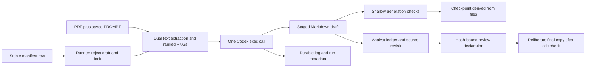

# Current pipeline and prompt reconstruction

Evidence labels: OBSERVED = directly established; INFERRED = interpretation of observations; UNKNOWN = insufficient evidence; CONFLICTING = sources disagree. CURRENT_SYSTEM refers only to live files outside the reference ZIP and audit outputs. Archive citations use `ZIP!rebuild/...:lines` and refer exclusively to REFERENCE_TARGET_ARCHITECTURE. Recommendations are PROPOSED_INTEGRATION, not executed changes.

## End-to-end supported path

OBSERVED: `pwsh -File scripts/run_summary.ps1 -SummaryName <existing-mapped-name.md>` resolves exactly one manifest row, rejects existing draft, obtains an exclusive generation lock, calls generator with source/stage/prompt paths, refreshes state in finally, then disposes lock. `-DryRun` displays metadata before locking. This audit did not invoke it (`scripts/run_summary.ps1:1-36`).

## Script contracts

| Script | Inputs and outputs | Execution/lifecycle |
| --- | --- | --- |
| .codex_build_summary_manifest.ps1 | docs/papers.md and recursive PDF paths -> .summary_manifest.csv | Recovers names from basename links, slugifies new names, suffixes collisions with 8 hash chars; requires exactly 112 PDFs; writes replacement CSV. Lines 3-48. |
| .codex_full_summary_worker.ps1 | Pdf,Target,PromptPath -> staged Markdown; .summary_work_<stem>_<PID> | Caller-root paths; one ephemeral Codex exec with danger-full-access; discards streams; shallow checks; containment-checked scratch deletion in finally. Lines 1-18,124-159,167-198. Legacy/superseded by supported wrapper, but still callable. |
| scripts/generate_summary.ps1 | Pdf,Target,PromptPath -> draft and analysis/evidence/<stem> | Repository-root target; rejects draft; one read-only-sandbox Codex exec; durable log/run; no lock of its own. Lines 1-31,145-212. |
| scripts/run_summary.ps1 | SummaryName, optional DryRun; manifest + saved prompt | Exclusive handle serializes wrapper generation and state refresh; direct generator/state calls bypass it. Lines 1-36. |
| scripts/summary_state.py | Manifest,prompt,baseline,reviews,PDFs,drafts,finals,run records -> checkpoint JSON/MD | No arguments, recomputes file predicates; initializes missing baseline; no model calls, no promotion; fixed temporary filenames. Lines 80-184. |

OBSERVED dependencies: PowerShell, discoverable `python`, PyMuPDF/fitz, PyPDF2, and discoverable `codex`; no version lock. Generator passes source/work paths as arguments, matching skill guidance about prior concurrent environment-variable contamination. Neither worker pins model, reasoning effort, package, CLI or script version. Current invocation is `codex exec --ephemeral -s read-only -C <root> -o <stage-target>` plus image arguments and standard-input prompt; CLI writes requested output despite model tool-use restriction (`generate_summary.ps1:14-15,34-42,167-175`).

## Extraction and retained evidence

OBSERVED (`generate_summary.ps1:34-138`): for every page, native PyMuPDF and PyPDF2 text are compared by length; only the longer text is retained with page boundaries. Extraction disagreements are not reconciled. A PyPDF2 error string can participate in that comparison. Native text below 80 characters flags OCR need but no OCR runs. Image counts and figure/table/diagram/algorithm/architecture/equation mentions rank pages; at most 56 are rendered whole-page at 1.25 scale. This heuristic is not an object coverage inventory. Embedded attachment count is recorded without extracting attachments. Appendix detection can match references. Current missing-page metadata states unassessed, whereas old metadata used an empty list.

| Workspace | Contents | Identity/lifecycle |
| --- | --- | --- |
| analysis/evidence/retrieval_barrier_comprehensive_summary | 21 files: article/accessibility/images, 15 PNGs, run/log/partial ledger | 20-page source; selected 1,2,4-14,19,20; run finished 2026-09-07 15:34 UTC requiring source review. |
| .summary_work_retrieval_barrier_comprehensive_summary_46468 | 18 files: article/accessibility/images plus 15 PNGs | Same article SHA and all 15 image hashes as durable Retrieval run; old accessibility differs; retains historical evidence. |
| .summary_work_toolhijacker_comprehensive_summary_46468 | 17 files: article/accessibility/images plus 14 PNGs | 18-page source; selected 1,2,3,5-12,16-18; no v2 draft or new run metadata; unique retained extraction. |

Evidence: `ARTIFACT_INVENTORY.csv` hashes; each accessibility.json page_count/visual_pages; Retrieval `run.json`. Retrieval text hash is `0943dbea1e6e5bc5603c43a596fa91bf9d45749e0435e558f6a47818bc415a86`; ToolHijacker text hash is `41a72adbe70f737ee900aaa7fb8308e0d7b2dd90f453e4baac05d5ff7cac555a`.

Creation sequence is run=running -> text/accessibility/PNGs/image list -> composed prompt -> one Codex call/log -> draft structural checks -> completed/failed run -> wrapper checkpoint. Ledger is an analyst-maintained artifact, not produced by that code. Retrieval ledger at lines 3,8-17,35-39 records only partial source review (pp10-11, Figure 9/Table 2), missing review.md and no attestation. Direct visual inspection in this audit confirmed page10 is a retained figure/text page; it did not verify the entire summary.

## Heavy prompt versus enforcement

OBSERVED: `analysis/PROMPT.md` has 1,249 lines, SHA-256 `21dd3b9e6cd783df7c7ff7c40543a620c4d4cbbb54990dc560a33f3b5a557988`. It defines closed-document A author / B observable / C derived / D interpretation / E external distinctions, Stage 0 capability reporting, full object inventory, cumulative extraction before narrative, every substantive visual, equations/experiments, source-grounded revisit, long-document persistent ledgers, 22 final sections, and inventory-denominated completeness. No explicit semantic version is present (`PROMPT.md:61-100,103-262,265-746,749-814,817-1211`).

OBSERVED: wrappers add instructions to avoid tools/external facts and emit final Markdown from the supplied whole text and selected PNGs. They do not persist a pre-narrative ledger or perform later independent source review (`generate_summary.ps1:145-175`; `WORKFLOW.md:89-92`). Generation validates 20,000 characters and required phrase substrings; the state manager improves this to numbered heading/order checks, but neither establishes factual/visual completeness. No exact historical prompt is provable for 36 recovered drafts. Retrieval log contains the current full prompt and is stronger generation-time evidence. Embedded wrappers are additional instruction generations, not a replacement rubric.

## Failures, idempotency and concurrency

OBSERVED: no retry loop, scheduler or quota parser. Quota stopping is procedural (`WORKFLOW.md:19-36`). Supported runner refuses any draft, including partial failed output. Current generator retains evidence and records failed_or_interrupted on caught errors; abrupt death may leave running. Retrying without a draft reuses the stem directory and overwrites run/log/extraction; stale extra PNGs may remain. Thus retention is durable but not immutable attempt history (`generate_summary.ps1:13-31,131-138,173,202-212`).

INFERRED concurrency risks, not observed corruption: bypassing wrapper permits competing output/evidence writes; direct refreshes race on fixed .tmp names; JSON/MD replacement can diverge across an interruption; Google Drive's synchronized location is evident from the absolute path but cross-host lock/rename guarantees were not tested. Do not regard a synced lock filename as a distributed lease. The account allowance is unknown and the current two-paper sequential preference must survive future wrappers (`AGENTS.md:13-16`).
