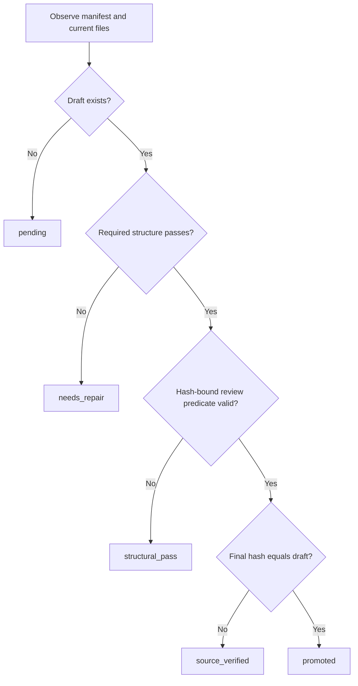

# Current state model

Evidence labels: OBSERVED = directly established; INFERRED = interpretation of observations; UNKNOWN = insufficient evidence; CONFLICTING = sources disagree. CURRENT_SYSTEM refers only to live files outside the reference ZIP and audit outputs. Archive citations use `ZIP!rebuild/...:lines` and refer exclusively to REFERENCE_TARGET_ARCHITECTURE. Recommendations are PROPOSED_INTEGRATION, not executed changes.

## Authority and identities

OBSERVED: The unit is a manifest row, joined through `SummaryName`; source path, staged target, final target, and `ExistingName` are retained separately. There is no standalone paper ID. Two manifests are byte-identical (SHA-256 `e3bf75767e8232ea73df524b00fa5a492cd83b1846405976a4e23a9e4c39344d`). The builder recovers 48 legacy names from PDF basenames in docs and generates 64 others, appending eight source-hash characters on name collision; rebuilding would depend on path ordering and historical docs (`.codex_build_summary_manifest.ps1:3-48`).

| Concept | Authority | Evidence |
| --- | --- | --- |
| Identity/path routing | analysis/manifest.csv | summary_state.py:82-83,109 |
| Source/draft/final content | actual files and SHA-256 | summary_state.py:25-29,110-112 |
| Current rubric | analysis/PROMPT.md hash | summary_state.py:85-87 |
| Review declaration | reviews.json plus exact hashes and notes-file existence | summary_state.py:115-123 |
| Recovery origin | baseline.json | summary_state.py:99-102,124-127,151-155 |
| Derived progress | script predicates; JSON/Markdown checkpoint are exports | summary_state.py:144-180 |
| Generation attempt observation | evidence/<summary-stem>/run.json | summary_state.py:128-135 |

## Predicates, not enforced event transitions

OBSERVED (`scripts/summary_state.py:47-70,112-123`): missing staged draft -> pending; existing failed shape -> needs_repair; passed shape -> structural_pass. Shape requires 22 numbered Markdown heading matches, normalized lowercase alphanumeric title substrings, first-match order, a Stage 0 heading, a completeness-audit heading, and >=20,000 characters. Stage 0 need not be first and audit need not be last. Body text cannot substitute for headings.

Review is valid only if source and draft exist, draft shape passes, review source/prompt/draft hashes equal observed hashes, reviewed_at and notes_path are truthy, and the resolved notes file exists. A valid review yields source_verified, or promoted when final and draft hashes match. Review-note contents/hash, reviewer identity, date syntax, ledger coverage, images, model and script version are not checked. Missing source raises an issue but may leave structural_pass.

Any observation can regress after edits/deletions. No permanent terminal state or transition event history exists. Pending includes 19 papers with legacy summaries; old finals do not satisfy the new rubric. Generation run states running/generated_requires_source_review/failed_or_interrupted are a separate axis, never substitutes for review status (`generate_summary.ps1:22-31,202-212`).

## Baseline, review, promotion and recovery

OBSERVED: baseline created at 2026-09-07T15:19:22.802049+00:00 stores source/draft/final hashes for all 112 rows, with 36 drafts and 48 finals. Missing baseline causes refresh to create one, conflicting with the procedural instruction never silently reset it. Only source changes, not final edits, are automatically flagged against baseline (`summary_state.py:124-127,151-155`; `WORKFLOW.md:46`).

Promotion is procedural: compare final with baseline/last reviewed version, inspect diff, copy reviewed draft, refresh. No promotion API or automated user-edit guard is implemented (`WORKFLOW.md:97-105`). Editing review notes alone would not invalidate the predicate.

OBSERVED: wrapper refuses any existing staged draft and acquires an exclusive generation.lock file handle. A lingering zero-byte filename is not a held lock. Process inspection during this audit found app-server/audit processes, not a live paper-generation worker; no locks were acquired or processes terminated. Crashes can leave stale running metadata, and no lease/reaper exists. No current run is marked failed or running; Retrieval is generated_requires_source_review. Older scratch proves retained extraction, not a still-running process (`run_summary.ps1:12-36`; `WORKFLOW.md:19-36`).

OBSERVED: state writes fixed .tmp filenames then replaces destinations; JSON and Markdown checkpoint writes are separate. Direct state refresh has no lock. Malformed JSON, inaccessible files, bad notes paths or missing run status fields can abort the whole refresh. Wrapper invokes native Python in finally without an explicit exit-code check. No transactional recovery, per-record isolation or retry queue exists (`summary_state.py:73-87,128-180`; `run_summary.ps1:25-36`).

## Reconciliation and frontier

OBSERVED: all current source/draft/final fingerprints and statuses match saved checkpoint, dated 2026-09-07T15:34:25.812097+00:00. Only Retrieval draft differs from baseline (null -> `945561f59ec6a1d41e986254c7f74e413fdd1d039a443d7a7d1cc8b6bffff9ff`). No source/final baseline changes, missing manifest sources, unmapped drafts/finals/evidence, review records, or hash-unmatched archived copies were found (`AUDIT_MEASUREMENTS.json`; `RECONCILIATION_DETAILS.json`).

| Definition | Count |
| --- | --- |
| Active manifest source reports | 112 |
| Unique PDF hashes | 112 |
| Legacy summary coverage | 48 |
| V2 structural passes | 37 |
| Valid source review attestations | 0 |
| Promoted under current predicate | 0 |
| New-workflow partial source reviews | 1 |
| Newer extraction-only attempts | 1 |
| No processing artifact found | 56 |

UNKNOWN: completed scientific review outside the retained registry and exact number of independent contributions. Two probable version groups would give 110 candidate contribution groups if collapsed, but this is not an adjudicated total. Do not label the 56 artifact-free records as historically never read.

## Exact paper lists by highest observed artifact level

### UNREVIEWED_DRAFT (36)

- `autowebglm_comprehensive_summary.md`
- `go_browse_comprehensive_summary.md`
- `seeact_comprehensive_summary.md`
- `laser_comprehensive_summary.md`
- `react_comprehensive_summary.md`
- `webvoyager_comprehensive_summary.md`
- `bearcubs_comprehensive_summary.md`
- `browsecomp_comprehensive_summary.md`
- `mind2web_comprehensive_summary.md`
- `mmina_comprehensive_summary.md`
- `browsergym_comprehensive_summary.md`
- `visualwebarena_comprehensive_summary.md`
- `webarena_comprehensive_summary.md`
- `weblinx_comprehensive_summary.md`
- `webshop_comprehensive_summary.md`
- `workarena_comprehensive_summary.md`
- `workarena_plus_comprehensive_summary.md`
- `autoscraper_comprehensive_summary.md`
- `mind2web_2_comprehensive_summary.md`
- `webdancer_comprehensive_summary.md`
- `webgpt_comprehensive_summary.md`
- `websailor_comprehensive_summary.md`
- `webscraper_comprehensive_summary.md`
- `webwalker_comprehensive_summary.md`
- `advagent_controllable_blackbox_red_teaming_on_web_agents_comprehensive_summary.md`
- `agentfuzzer_generic_black_box_fuzzing_for_indirect_prompt_injection_against_llm_agents_comprehensive_summary.md`
- `agentvigil_generic_black_box_red_teaming_for_indirect_prompt_injection_against_llm_agents_comprehensive_summary.md`
- `attacking_vision_language_computer_agents_via_pop_ups_comprehensive_summary.md`
- `commercial_llm_agents_are_already_vulnerable_to_simple_yet_dangerous_attacks_comprehensive_summary.md`
- `dissecting_adversarial_robustness_of_multimodal_lm_agents_comprehensive_summary.md`
- `eia_environmental_injection_attack_on_generalist_web_agents_for_privacy_leakage_comprehensive_summary.md`
- `searchgeo_comprehensive_summary.md`
- `canary_tokens_comprehensive_summary.md`
- `indirect_prompt_injection_real_world_comprehensive_summary.md`
- `forge_comprehensive_summary.md`
- `planguard_defending_agents_against_indirect_prompt_injection_via_planning_based_consistency_verification_comprehensive_summary.md`

### DRAFT_WITH_PARTIAL_REVIEW (1)

- `retrieval_barrier_comprehensive_summary.md`

### EXTRACTION_ONLY (1)

- `toolhijacker_comprehensive_summary.md`

### LEGACY_ONLY (18)

- `unsafe_llm_search_comprehensive_summary.md`
- `when_ai_meets_web_comprehensive_summary.md`
- `formalizing_prompt_injection_comprehensive_summary.md`
- `safearena_comprehensive_summary.md`
- `st_webagentbench_comprehensive_summary.md`
- `wasp_comprehensive_summary.md`
- `ace_comprehensive_summary.md`
- `rennervate_comprehensive_summary.md`
- `ward_comprehensive_summary.md`
- `toward_secure_llm_agents_comprehensive_summary.md`
- `androidworld_comprehensive_summary.md`
- `awe_comprehensive_summary.md`
- `backdooragent_comprehensive_summary.md`
- `evocrawl_comprehensive_summary.md`
- `gorilla_comprehensive_summary.md`
- `skilltrojan_comprehensive_summary.md`
- `toolformer_comprehensive_summary.md`
- `yurascanner_comprehensive_summary.md`

### NO_PROCESSING_ARTIFACT_FOUND (56)

- `vpi_bench_visual_prompt_injection_attacks_for_computer_use_agents_comprehensive_summary.md`
- `waaa_web_adversaries_against_agentic_browsers_comprehensive_summary.md`
- `webcloak_characterizing_and_mitigating_threats_from_llm_driven_web_agents_as_intelligent_scrapers_comprehensive_summary.md`
- `webinject_prompt_injection_attack_to_web_agents_comprehensive_summary.md`
- `agentlab_benchmarking_llm_agents_against_long_horizon_attacks_comprehensive_summary.md`
- `ai_agent_traps_comprehensive_summary.md`
- `breaking_agents_compromising_autonomous_llm_agents_through_malfunction_amplification_comprehensive_summary.md`
- `context_manipulation_attacks_web_agents_are_susceptible_to_corrupted_memory_comprehensive_summary.md`
- `hidden_in_memory_sleeper_memory_poisoning_in_llm_agents_comprehensive_summary.md`
- `how_adversarial_environments_mislead_agentic_ai_comprehensive_summary.md`
- `its_a_trap_task_redirecting_agent_persuasion_benchmark_for_web_agents_comprehensive_summary.md`
- `mind_the_web_the_security_of_web_use_agents_5a834c4e_comprehensive_summary.md`
- `mind_the_web_the_security_of_web_use_agents_comprehensive_summary.md`
- `autonomy_comes_with_costs_detecting_denial_of_service_vulnerabilities_caused_by_resource_abusing_in_llm_based_agents_comprehensive_summary.md`
- `beyond_max_tokens_stealthy_resource_amplification_via_tool_calling_chains_in_llm_agents_comprehensive_summary.md`
- `denial_of_wallet_defining_a_looming_threat_to_serverless_computing_comprehensive_summary.md`
- `overthinking_loops_in_agents_a_structural_risk_via_mcp_tools_comprehensive_summary.md`
- `recurguard_runtime_monitoring_for_reasoning_token_consumption_attacks_comprehensive_summary.md`
- `when_agents_do_not_stop_uncovering_infinite_agentic_loops_in_llm_agents_comprehensive_summary.md`
- `agentdojo_a_dynamic_environment_to_evaluate_prompt_injection_attacks_and_defenses_for_llm_agents_comprehensive_summary.md`
- `indirect_prompt_injections_are_firewalls_all_you_need_or_stronger_benchmarks_comprehensive_summary.md`
- `securewebarena_a_holistic_security_evaluation_benchmark_for_lvlm_based_web_agents_comprehensive_summary.md`
- `browsesafe_understanding_and_preventing_prompt_injection_within_ai_browser_agents_comprehensive_summary.md`
- `cellmate_sandboxing_browser_ai_agents_comprehensive_summary.md`
- `defeating_prompt_injections_by_design_comprehensive_summary.md`
- `defending_against_indirect_prompt_injection_attacks_with_spotlighting_comprehensive_summary.md`
- `isolategpt_an_execution_isolation_architecture_for_llm_based_agentic_systems_comprehensive_summary.md`
- `melon_provable_defense_against_indirect_prompt_injection_attacks_in_ai_agents_comprehensive_summary.md`
- `prismata_confining_cross_site_prompt_injection_in_web_agents_comprehensive_summary.md`
- `secalign_defending_against_prompt_injection_with_preference_optimization_comprehensive_summary.md`
- `snapguard_lightweight_prompt_injection_detection_for_screenshot_based_web_agents_comprehensive_summary.md`
- `struq_defending_against_prompt_injection_with_structured_queries_comprehensive_summary.md`
- `the_task_shield_enforcing_task_alignment_to_defend_against_indirect_prompt_injection_in_llm_agents_comprehensive_summary.md`
- `untrusted_content_masking_for_web_agents_with_security_guarantees_comprehensive_summary.md`
- `webagentguard_a_reasoning_driven_guard_model_for_detecting_prompt_injection_attacks_in_web_agents_comprehensive_summary.md`
- `agentrewardbench_evaluating_automatic_evaluations_of_web_agent_trajectories_comprehensive_summary.md`
- `an_illusion_of_progress_assessing_the_current_state_of_web_agents_comprehensive_summary.md`
- `focusagent_simple_yet_effective_ways_of_trimming_the_large_context_of_web_agents_comprehensive_summary.md`
- `guide_interpretable_gui_agent_evaluation_via_hierarchical_diagnosis_comprehensive_summary.md`
- `odysseys_benchmarking_web_agents_on_realistic_long_horizon_tasks_comprehensive_summary.md`
- `the_long_horizon_task_mirage_diagnosing_where_and_why_agentic_systems_break_comprehensive_summary.md`
- `webchorearena_evaluating_web_browsing_agents_on_realistic_tedious_web_tasks_comprehensive_summary.md`
- `detection_of_crawler_traps_formalization_and_implementation_defeating_protection_on_internet_and_on_the_tor_network_comprehensive_summary.md`
- `irlbot_scaling_to_6_billion_pagesand_beyond_comprehensive_summary.md`
- `measuring_what_the_crawler_sees_discovery_curves_core_persistence_and_shell_dynamics_in_longitudinal_web_crawls_comprehensive_summary.md`
- `the_impact_of_crawl_policy_on_web_search_effectiveness_comprehensive_summary.md`
- `web_crawling_comprehensive_summary.md`
- `a_survey_on_autonomy_induced_security_risks_in_large_model_based_agents_comprehensive_summary.md`
- `a_survey_on_trustworthy_llm_agents_threats_and_countermeasures_comprehensive_summary.md`
- `a_systematic_survey_of_security_threats_and_defenses_in_llm_based_ai_agents_a_layered_attack_surface_framework_comprehensive_summary.md`
- `sok_attack_and_defense_landscape_of_agentic_ai_systems_comprehensive_summary.md`
- `talk_is_not_cheap_a_taxonomy_and_benchmark_coverage_audit_for_llm_attacks_comprehensive_summary.md`
- `dont_click_that_teaching_web_agents_to_resist_deceptive_interfaces_comprehensive_summary.md`
- `doomarena_a_framework_for_testing_ai_agents_against_evolving_security_threats_comprehensive_summary.md`
- `injecagent_benchmarking_indirect_prompt_injections_in_tool_integrated_large_language_model_agents_comprehensive_summary.md`
- `the_hidden_dangers_of_browsing_ai_agents_comprehensive_summary.md`

## Test contract

OBSERVED: four existing tests cover placeholder structure passing, body-versus-heading mismatch, order/length, missing-file hash and path escape (`scripts/test_summary_state.py:23-44`). They intentionally prove shape is not science. No tests cover attestation semantics, baseline reset, promotion protection, race recovery or malformed per-paper state. Audit computations reproduce predicates independently; no state refresh or pipeline execution occurred.
