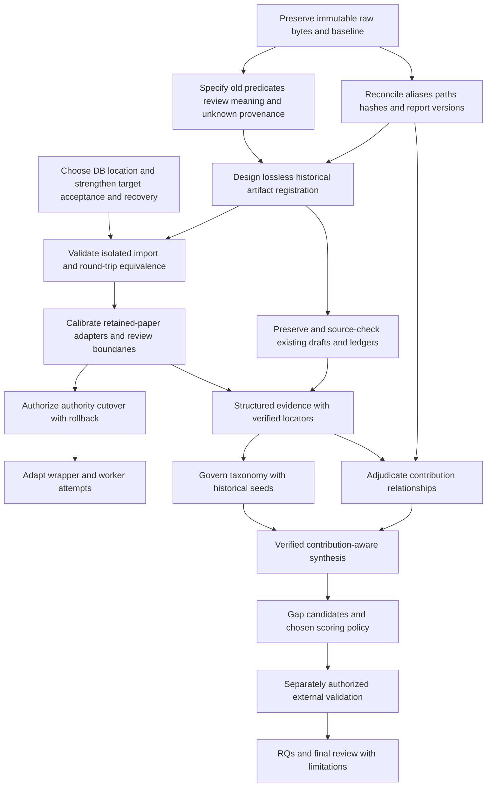

# Preservation map and migration dependencies

All treatments below are PROPOSED_INTEGRATION. No migration was performed. They follow observed current authority, retained artifact quality and target behavior; exact source evidence appears in each row and the compatibility CSV.

## Existing components

| Current component | Treatment | Reason / evidence |
| --- | --- | --- |
| 117 PDFs and folder paths | PRESERVE_AS_IS | Keep all hashes and report variants; CORPUS_INVENTORY.csv; source-only content remains factual authority. |
| Root AGENTS and corpus-analysis skill | WRAP_FOR_COMPATIBILITY | Retain rubric routing, sequential batch preference, quota stopping and review rules; AGENTS.md:3-19; SKILL.md:7-26. |
| Heavy PROMPT.md | PRESERVE_READ_ONLY | Exact user rubric/hash is an invariant; generic placeholder must not replace it; PROVENANCE_AUDIT.md. |
| Both manifests | IMPORT_STATE | Preserve SummaryName and all original path/target fields; manifests identical; builder depends on historical naming. |
| checkpoint.json and CHECKPOINT.md | PRESERVE_READ_ONLY | Keep dated observations and import predicates separately; not generation provenance or permanent acceptance. |
| baseline.json | IMPORT_STATE | Only recovery-era fingerprints; needed to detect pre-existing final edits; summary_state.py:124-127; WORKFLOW.md:102-105. |
| reviews.json | IMPORT_STATE | Empty is a meaningful observation; no approvals may be synthesized. Preserve format for any later live additions. |
| 48 legacy summaries | PRESERVE_READ_ONLY | Existing published generation and 48-paper synthesis evidence; register raw artifacts without implying new-rubric approval. |
| 37 v2 drafts | REGENERATE_ONLY_IF_NECESSARY | Reusable drafts all pass shape but lack attestations; review/repair selectively rather than blanket paid regeneration. |
| Durable evidence run | PRESERVE_AS_IS | Only retained full log/run plus partial ledger; review is unfinished; ledger.md:3-39. |
| Two old scratch directories | PRESERVE_READ_ONLY | ToolHijacker extraction unique; Retrieval identical images/text but distinct accessibility history; do not garbage-collect before verified import. |
| Current PowerShell generation wrapper | WRAP_FOR_COMPATIBILITY | Preserve no-overwrite semantics and serialized generation until target acceptance is validated. |
| Legacy worker and manifest builder | RETIRE_AFTER_VALIDATION | Historical behavior explains provenance; do not delete or rerun during migration. Archive once replacements preserve recovery semantics. |
| Python state manager | SUPERSEDE_AFTER_MIGRATION | Use as read-only comparison oracle through cutover; preserve its weaker structural/review semantics explicitly. |
| Historical gap analysis and matrices | PRESERVE_READ_ONLY | 48-summary scope, local candidates and qualitative priorities remain historical; adapt concepts, not evidence acceptance. |
| Organizer scripts and inventory | PRESERVE_READ_ONLY | Original/New-preferred variants retain different canonical policies and historical source paths; reruns replace inventory. |
| Duplicate/version folders | PRESERVE_AS_IS | Exact bytes already classified; probable versions remain independent source reports until adjudicated. |
| Empty manual-review folder | HUMAN_DECISION_REQUIRED | Empty directory does not mean all version/metadata decisions resolved; distinguish disposition from evidence review. |
| Git state and ignored artifacts | PRESERVE_AS_IS | Initial Git changes predate audit; Git ignore omits logs/text/PNGs. Full-file baseline required. |
| Reference ZIP | PRESERVE_READ_ONLY | Immutable reference input; package contents are not live features; reference package SHA recorded. |

## Reference components

Every reusable target component has an explicit treatment in `REFERENCE_ARCHITECTURE_COMPATIBILITY.csv`. No generic executable is recommended for unconditional direct adoption. Adapt source/evidence/schema contracts, wrap current state/generation until verified cutover, merge identity/taxonomy/protocol concepts, replace state only after a lossless migration, reject the empty workspace template as unnecessary for the live tree, and postpone scientific scope/scoring/external-validation policy pending human decisions. These recommendations follow target acceptance gaps documented in `EXISTING_VS_PROPOSED_ARCHITECTURE.md`, not an assumption that SQLite itself solves provenance.

## Migration invariants

| Invariant | Location | Confidence | Why / accidental loss mechanism |
| --- | --- | --- | --- |
| Exact source bytes and report distinctions | PDFs, inventory hashes | HIGH | Title-based deduplication would erase distinct versions; 112 hashes is not independent study count. |
| Stable SummaryName aliases and target paths | Two manifests, baseline/review keys, evidence stems | HIGH | Generic P-number ingest or rebuilding slugs can break joins and orphan old outputs. |
| Baseline versus current fingerprints | baseline.json and checkpoint.json | HIGH | Resetting baseline erases recovery origin and user-edit comparison basis. |
| Unreviewed versus reviewed status | reviews.json, script predicate, partial ledger | HIGH | Marking all drafts DONE/verified manufactures scientific approval. |
| Both prose generations | Summaries and .summary_v2 | HIGH | Overwriting finals would lose user-visible accepted legacy content before review. |
| Exact rubric and provenance uncertainty | PROMPT.md, Retrieval run/log, old missing records | HIGH | Replacing prompt or backfilling current hashes falsely attributes historical inputs. |
| Partial source revisit evidence | Retrieval ledger and scratch | HIGH | Cache cleanup loses paid extraction and unfinished review boundary. |
| Historical collection scope and aliases | docs, report, C/S/B IDs, paper_inventory | HIGH | Relabeling as expanded corpus/systematic review corrupts denominators and novelty status. |
| Version relationships without premature merging | Mind-the-Web and AgentVigil sources | HIGH for identity; MEDIUM for contribution relationship | Hash duplicate grouping alone misses double-counting; collapsing before delta review loses report-specific methods/results. |
| Two-paper sequential/quota-stop preference | AGENTS.md and WORKFLOW.md | HIGH | Generic four-worker default could violate user resource expectations. |
| Uncommitted user reorganization | INITIAL_BASELINE.json git_status and file hashes | HIGH | Reset/clean/move-based migration would discard user changes. |

## Dependency graph: safe future sequence

Dependencies are not a claim that every paper must be regenerated. B precedes all imports because SummaryName joins and historical paths carry identity. C precedes acceptance because structural_pass has no item verification meaning. D preserves raw evidence before code/schema transformation. F precedes cutover because target late-result acceptance and SQL/file non-atomicity can invalidate imported history. J can proceed from preserved artifacts without waiting for an authority switch, but no existing review is upgraded automatically. L must precede synthesis denominators; N needs source evidence rather than folder membership. External search is a separate future authorization, not part of this audit. Evidence: current `summary_state.py:109-135`, `WORKFLOW.md:61-105`; target `litrevctl.py:199-302,347-410`; historical `docs/gaps_and_research_directions.md:355-364`.

## Unsafe direct-copy operations

Do not copy ZIP AGENTS or master instructions into the live root; do not install its skills over `.agents/skills/corpus-analysis`; do not copy its workspace template, placeholder prompt, config, schemas, controller scripts or db into current paths. Such copying could auto-initialize conflicting authority, discard rubric/names, reclassify raw drafts as accepted, or change resource/search policy. Preserve the original reference ZIP and build a separately reviewed compatibility layer instead. No SQLite or migration action was performed.
