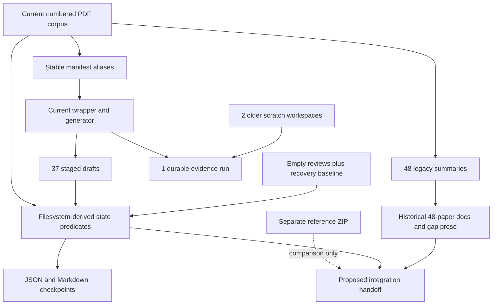

# Workspace architecture

Evidence labels: OBSERVED = directly established; INFERRED = interpretation of observations; UNKNOWN = insufficient evidence; CONFLICTING = sources disagree. CURRENT_SYSTEM refers only to live files outside the reference ZIP and audit outputs. Archive citations use `ZIP!rebuild/...:lines` and refer exclusively to REFERENCE_TARGET_ARCHITECTURE. Recommendations are PROPOSED_INTEGRATION, not executed changes.

## Boundary and environment

OBSERVED root: `G:\My Drive\Papers\Agentic Web Crawlers`. Baseline completed `2026-09-13T14:24:24.580547+00:00`; environment `Windows-11-10.0.26200-SP0`, Python `3.12.13 (main, May 10 2026, 19:35:37) [MSC v.1944 64 bit (AMD64)]`, PowerShell 7.6.5, Git branch `main`. The path appears Google Drive synchronized; sync health and multi-host atomicity were not established. `.gitattributes:1` declares PDFs binary, and `.git/config` has no LFS filter; no LFS configuration was found. Git was already dirty with relocated-source deletions/untracked replacements. Full initial status and 979 pre-existing file hashes, including .git and reference ZIP, are in `INITIAL_BASELINE.json`.

## Complete root inventory

| Item | Role | Direct entries if directory |
| --- | --- | --- |
| .agents | CODEX_SKILL | 1 |
| .codex_build_summary_manifest.ps1 | SCRIPT |  |
| .codex_full_summary_worker.ps1 | SCRIPT |  |
| .git | CONTROL_STATE | 13 |
| .gitattributes | CONTROL_STATE |  |
| .summary_manifest.csv | CONTROL_STATE |  |
| .summary_v2 | CURRENT_SUMMARY | 37 |
| .summary_work_retrieval_barrier_comprehensive_summary_46468 | WORKING_CACHE | 18 |
| .summary_work_toolhijacker_comprehensive_summary_46468 | WORKING_CACHE | 17 |
| 01_Core_Web_Agent_Architectures | SOURCE_CORPUS | 6 |
| 02_Web_Agent_Benchmarks_Environments | SOURCE_CORPUS | 11 |
| 03_Agentic_Search_Scraping_Info_Seeking | SOURCE_CORPUS | 7 |
| 04_Adversarial_Web_Prompt_Injection_Content_Manipulation | SOURCE_CORPUS | 19 |
| 05_Agentic_Traps_Persistence_Adaptive_Attacks | SOURCE_CORPUS | 9 |
| 06_Resource_Exhaustion_Availability_Denial_of_Wallet | SOURCE_CORPUS | 6 |
| 07_Security_Benchmarks_Evaluation | SOURCE_CORPUS | 7 |
| 08_Defenses_Guards_Containment | SOURCE_CORPUS | 17 |
| 09_Progress_Long_Horizon_Benign_Controls | SOURCE_CORPUS | 7 |
| 10_Traditional_Crawling_Crawler_Traps | SOURCE_CORPUS | 5 |
| 11_Surveys_Taxonomies_SoK | SOURCE_CORPUS | 6 |
| 12_Contextual_Borderline | SOURCE_CORPUS | 12 |
| 98_Manual_Review | MANUAL_REVIEW | 0 |
| 99_Duplicates | DUPLICATE_STORAGE | 1 |
| agentic_ai_web_agents_literature_search_report.md | DOCUMENTATION |  |
| AGENTS.md | CODEX_INSTRUCTION |  |
| analysis | ANALYSIS | 12 |
| Borderline | HISTORICAL_ARTIFACT | 0 |
| Codex_Literature_Review_Production_Architecture.zip | REFERENCE_TARGET_ARCHITECTURE |  |
| current_repo.txt | UNKNOWN |  |
| docs | DOCUMENTATION | 7 |
| New | HISTORICAL_ARTIFACT | 0 |
| organize_agentic_web_crawlers.py | SCRIPT |  |
| organize_agentic_web_crawlers_new_preferred.py | SCRIPT |  |
| README.md | DOCUMENTATION |  |
| scripts | SCRIPT | 6 |
| Security | HISTORICAL_ARTIFACT | 0 |
| Summaries | LEGACY_SUMMARY | 48 |

OBSERVED: numbered 01-12 folders contain the 112 manifest sources; 98_Manual_Review is empty; 99_Duplicates contains five archived byte copies. New/Security/Borderline are empty historical locations. Directory roles are corroborated by source paths/hashes and organizer code, not names alone (`CORPUS_INVENTORY.csv`; organizer new_preferred:331-376,510-568). `current_repo.txt` is a historical directory listing, not a live state source: it lists September 7 output and stale __pycache__ entries. The reference ZIP is a proposed input only.

## Instruction hierarchy and conflicts

| Source | Scope / role | Relationship or conflict |
| --- | --- | --- |
| Current user audit instructions | Audit only; read-mostly with bounded output writes | Overrides normal state-refresh, summarization, promotion and PDF scratch conventions. |
| AGENTS.md:1-19 | Paper analysis/recovery coordinator instructions | Routes to workflow/checkpoint/rubric and local skill; sequential two-paper generation; untrusted papers remain evidence. |
| .agents/skills/corpus-analysis/SKILL.md:1-26 | Only project-local skill found; recovery, deep reading, evidence, state and review coordination | Composite analysis/recovery skill, not a general literature-review router. No local agents/openai.yaml exists. |
| analysis/WORKFLOW.md:1-125 | Authority, recovery, evidence and deliberate promotion | Makes draft versus reviewed distinction; some protections procedural only. Refresh instruction suspended for audit. |
| analysis/PROMPT.md:1-1249 | Exact heavy paper-analysis rubric | Read as audit evidence, not executed. Whole-document evidence requirements exceed generator automation. |
| analysis/REVIEW_TEMPLATE.md:1-57 | Reusable evidence and source-revisit table structure | Empty template is not completed ledger; never copied into live evidence by audit. |
| README.md and docs | Historical 48-summary corpus guide/synthesis | Stale layout/counts; preserves historical concepts but cannot override current mapping. |
| Installed PDF skill | Audit extraction and visual inspection guidance | Used existing bundled pypdf/pypdfium2; audit scratch boundary overrides default output/temp paths. |
| ZIP master/AGENTS/skills | REFERENCE_TARGET_ARCHITECTURE only | No live scope or instruction authority; not installed. |

OBSERVED configuration: `.git/config` records Git remote/branch; `.gitattributes` marks PDFs binary; `analysis/.gitignore:1-7` excludes rendered pages, text, image lists, logs, lock and temporary files; `scripts/.gitignore` excludes __pycache__. This means a Git-only backup omits unique research evidence. The live state model has no project configuration file or JSON schema collection; package config exists only in the ZIP (file inventory evidence).

## Historical and current layers

OBSERVED: Git history records June 24 collection/documentation work and July 22 comprehensive summaries (`RECONCILIATION_DETAILS.json:git_history`). Historical prose files still discuss 48 summaries; organized inventory captures 117 PDF locations. The recovered state baseline tracks 36 drafts, later 37 with Retrieval. Current checkpoint is a filesystem observation, not a source-quality attestation (`CURRENT_STATE_MODEL.md`).

The scratch-to-evidence arrow denotes observed identical Retrieval bytes, not proven copy execution. ToolHijacker scratch is unique and must remain available. Model provenance is rich only in Retrieval's durable log; most artifact links are reconstructed from stable manifest names and hashes (`PROVENANCE_AUDIT.md`).

## Historical synthesis and format comparison

OBSERVED: `docs/papers.md` has 26,933 words/754 lines; matrix 3,080/169; gaps 6,482/364; citation clusters 4,889/298; metadata ledger 3,159/138. These are human-readable synthesis products, not evidence-database outputs. Matrix claims 48-summary scope (`docs/problem_approach_matrix.md:3-7`); gaps explicitly deny global completeness (`docs/gaps_and_research_directions.md:5,9-12,355-364`); metadata distinguishes 33 local-complete, 14 local-plus-historical and one conflict (`docs/metadata_verification.md:98-111`). Those metadata labels do not imply source-reviewed summaries.

OBSERVED: gap prose includes eleven directions, RQs, hypotheses and a six-dimension 1-5 prioritization framework, but explicitly says not to collapse scores mechanically (`docs/gaps_and_research_directions.md:26-364,305-324`). Root report labels a July 22 closed-corpus audit and states search is not a PRISMA reproduction (`agentic_ai_web_agents_literature_search_report.md:5-12,211-215`). Historical URLs are not current external validation. A Toward Secure LLM Agents venue conflict remains between report TOSEM wording and metadata warnings (`report:107`; `metadata_verification.md:96,119`).

| Sample | Legacy | V2 / evidence | Interpretation |
| --- | --- | --- | --- |
| Retrieval Barrier | 5,652 words / 513 lines; nine sections | 15,886 words / 1,364 lines; Stage0 +22 +audit; durable run and partial ledger | Broader explicit figures/tables/maths/evidence/validity structure; no review attestation. Legacy lines6-509; v2:324-705,726-1002,1222-1364. |
| WebArena | 4,751 words /451 lines | 9,029 words /956 lines; rendering limitations disclosed | V2 separates axes of method, metrics, caveats and coverage; claims of visual inspection remain self-report. v2:5-19,840-944. |
| ToolHijacker | 5,094 words /606 lines | No v2; unique 18-page scratch extraction | Legacy-only output with partial newer attempt; not never processed. |
| WebInject | No legacy | No v2 or evidence | Representative no-processing-artifact source; title page accessible. Processing matrix row webinject_comprehensive_summary.md. |
| AgentVigil/AGENTFUZZER | No legacy for either | Two v2 drafts of probable related versions | Filename differences cannot establish independent contributions; first-page identity contradicts AGENTFUZZER filename. |

INFERRED: richer v2 structure improves explicit traceability opportunities but cannot prove higher scientific correctness. Both generations remain valuable artifacts. Historical documentation should be preserved read-only as 48-paper analysis and taxonomy seeds, not relabeled as complete expanded-corpus synthesis.

## Final preservation observation

OBSERVED: all pre-existing non-Git research/control files and the original reference ZIP remain byte-identical. Git status outside audit outputs is unchanged. Git-internal metadata did change: the index differs and Codex turn-diff capture files were added/replaced. The audit issued no Git mutation command and intentionally modified no pre-existing file; exact metadata writer attribution is UNKNOWN. Do not interpret this as an all-Git-bytes-unchanged guarantee. Full paths and before/after hashes are in PRESERVATION_CHECK.json. The session also observed PowerShell7.6.5 initially and7.6.6 after recovery; both environment observations are retained.
